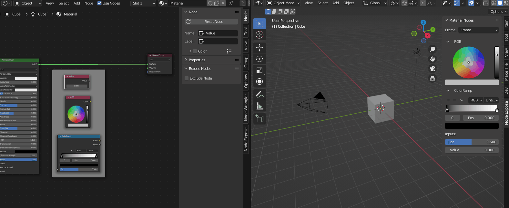

# Welcome to Node Expose

Node Expose gives you a simple way of exposing the properties of any node or group of nodes in the N menu of the 3D Viewport or Node Editor by framing your node(s). This means you can modify your material or geometry node setup without having to switch back and forth between the node editor and 3D Viewport. Using Node Expose is also a good way of indicating which parameters of a material or node setup can be tweaked safely and which should be left alone.

## Usage
Node Expose works with Material (Shader), Geometry, Compositor and Texture Nodes. For this example we'll use the shader node editor, but the same principle applies for the other node editors.

### Without Node Wrangler Add-on enabled
1. In the Blender startup file, select the default cube and switch to Shading mode.
2. Add a frame node ( **Shift A** > **Layout** > **Frame** )
3. Drag and drop the Principled BSDF Node inside the frame so that if you move the frame the BSDF node moves with it.
4. Select the Frame you have just added and in the N menu ( Right hand Menu ) Select the **Node** tab.
5. In the Expose Nodes panel click **Expose Frame**
6. You will now have a new tab, **Node Expose** in the N menu of the Node Editor, and the N Menu of the 3D Viewport where you can see the properties of the BSDF node.
7. Dragging and dropping more nodes into the frame will also expose them in this panel.

### With Node Wrangler Add-on enabled
1. In the Blender startup file, select the default cube and switch to Shading mode.
2. Select the Principled BSDF Node and press Shift + P to frame it
3. Select the Frame you have just added and in the N menu ( Right hand Menu ) Select the **Node** tab.
4. In the Expose Nodes panel in the **Node** tab click **Expose Frame**
5. You will now have a new tab, **Node Expose** in the N menu of the Node Editor, and the N Menu of the 3D Viewport where you can see the properties of the BSDF node.
6. Dragging and dropping more nodes into the frame will also expose them in this panel.

### Child Frames
If you want to organise your nodes into sub groups you can add additional child frames. Any nodes placed within these child frames will be grouped under the child frame in the side bar.

### Multiple Frames
If you only want to see the nodes in a child frame you can toggle on the **Expose Frame** option for that frame. The child frame will now be available in the drop down menu. You can also add multiple frames to your node setup in the same way.
